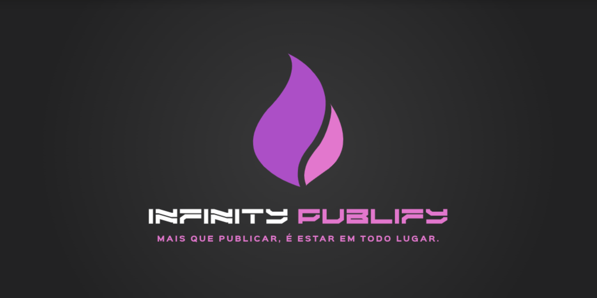

 

<h1 align="center"> < 🌎 Hello World!, Nosso nome é <strong>Infinity Publify</strong>  /> </h1>

<h2> Infinity Publify </h2>

 Bem-vindo ao InfinityPublify! Somos uma plataforma inovadora desenvolvida para simplificar e otimizar a gestão de publicações em redes sociais. Nosso objetivo é ajudar empresas, criadores de conteúdo e influenciadores a alcançarem um público maior e a gerenciarem suas presenças digitais de forma eficiente e profissional. 

 Na InfinityPublify, acreditamos que a gestão de conteúdo não precisa ser uma tarefa complexa e demorada. Por isso, nossa aplicação integra diversas redes sociais em um único local, permitindo que você crie, agende e publique conteúdo simultaneamente em múltiplas plataformas. Com recursos inteligentes, como o ajuste automático de formato e layout, nossa ferramenta adapta suas postagens às especificações de cada rede social, sem perder a qualidade e a coerência da mensagem. 

 Nosso time é composto por profissionais apaixonados pela tecnologia e pela inovação, com o compromisso de fornecer soluções que atendam às necessidades de cada usuário, independentemente do seu porte ou objetivo. A missão do InfinityPublify é transformar a forma como as marcas e indivíduos se conectam com seus públicos, simplificando a gestão de conteúdo e potencializando os resultados. 

<h2> Nossas Redes Sociais </h2>
    
     
     
    
    
     
    

 

 

    
    

 

  Feito com amor por <a href="https://infinitypublify.com" target="_blank" style="color: #AC4FC6">Infinity Publify</a>. 🩷  
  

